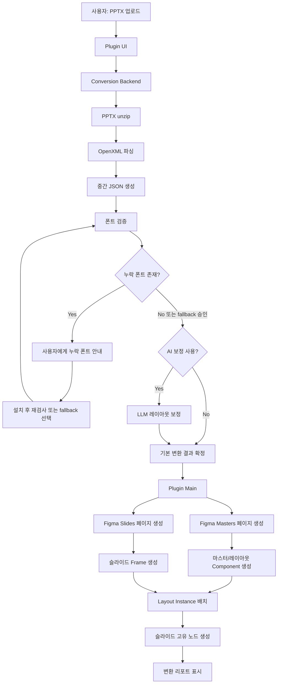

# PPT to Figma 변환 플러그인 PRD / 기술 설계서

**작성일:** 2026-05-04  
**문서 상태:** Draft  
**목적:** 사용자가 `.pptx` 파일을 업로드하면 PowerPoint 슬라이드, 레이아웃, 마스터 구조를 분석해 Figma 파일 안에 편집 가능한 프레임, 텍스트, 도형, 이미지, 마스터 컴포넌트로 변환하는 Figma 플러그인 및 변환 엔진의 구현 가능한 설계를 정의한다.

---

## 1. 문제 정의

PowerPoint와 Figma는 모두 시각 문서를 다루지만 내부 모델이 다르다.

- PowerPoint는 OpenXML 기반의 패키지 구조이며, `Slide Master -> Slide Layout -> Slide` 상속 구조를 가진다.
- Figma는 Scene Graph 기반이며, `Page -> Frame -> Node` 구조와 `Component -> Instance` 참조 구조를 가진다.
- PowerPoint의 마스터/레이아웃은 상속 기반이고, Figma에는 동일한 개념이 직접 존재하지 않는다.
- PowerPoint의 애니메이션, 전환 효과, SmartArt, 차트, 일부 테마 스타일은 Figma에서 1:1로 표현하기 어렵거나 불가능하다.

따라서 이 제품은 단순 파일 포맷 변환기가 아니라, PowerPoint 구조를 Figma 편집 모델로 재해석하는 변환 엔진이다. 1차 목표는 “최대한 편집 가능한 Figma 결과물”을 만드는 것이며, 모든 PowerPoint 기능의 완전 재현은 목표가 아니다.

---

## 2. 제품 목표

### 2.1 1차 제품 목표

- `.pptx` 파일을 Figma 플러그인에서 업로드한다.
- PPTX 내부 OpenXML 구조를 파싱한다.
- 슬라이드 크기, 배경, 텍스트, 이미지, 기본 도형을 Figma 노드로 변환한다.
- PPT 마스터와 레이아웃 구조를 Figma 컴포넌트 및 인스턴스 구조로 변환한다.
- PPT에서 사용된 폰트 중 Figma에서 사용할 수 없는 폰트를 감지하고 사용자에게 알려준다.
- 사용자가 폰트를 설치하거나 fallback 매핑을 선택한 뒤 다시 변환할 수 있게 한다.
- 상용 LLM API를 선택적으로 사용해 레이아웃 보정 제안을 생성한다.

### 2.2 사용자 목표

- 기존 PPT 자료를 Figma에서 다시 디자인하거나 편집할 수 있게 가져온다.
- PPT 마스터에 정의된 공통 배경, 로고, 푸터, 페이지 번호 영역을 Figma에서도 반복 사용 가능한 구조로 유지한다.
- 변환 실패 원인을 “깨진 결과물”로만 확인하지 않고, 누락 폰트/지원 불가 기능/변환 경고로 명확히 확인한다.
- AI 보정 옵션을 통해 PPT 좌표 기반 변환 후 생기는 미세한 정렬 깨짐을 줄인다.

### 2.3 비즈니스 목표

- 첫 버전은 PPT에서 Figma로 가져오는 명확한 단방향 워크플로우에 집중한다.
- 향후 Figma to PPT/POT 변환, 디자인 시스템 추출, 템플릿 자동 리빌드로 확장 가능한 기반을 만든다.
- “완전 자동 변환”보다 “검증 가능한 변환 + 사용자 통제 + 보정”을 핵심 차별점으로 삼는다.

---

## 3. 핵심 범위

### 3.1 이번 1차 범위에 포함

- `.pptx` 파일 업로드
- PPTX unzip 및 OpenXML 파싱
- 프레젠테이션 기본 정보 추출
- 슬라이드 크기 추출
- 슬라이드 목록과 순서 추출
- 슬라이드별 텍스트 박스 변환
- 슬라이드별 이미지 변환
- 기본 도형 변환
- 배경색 또는 배경 이미지 변환
- 테마 색상 기본 해석
- PPT 마스터 추출
- PPT 레이아웃 추출
- 마스터/레이아웃을 Figma 컴포넌트로 생성
- 각 슬라이드를 Figma Frame으로 생성
- 각 슬라이드 Frame 내부에 해당 마스터/레이아웃 인스턴스 배치
- 누락 폰트 감지
- 누락 폰트 사용자 안내
- fallback 폰트 매핑 적용
- 변환 경고 리포트 생성
- 선택형 LLM 레이아웃 보정

### 3.2 이번 1차 범위에서 제외

- Figma to PPT 변환
- POT 템플릿 생성
- PowerPoint 애니메이션 변환
- PowerPoint 전환 효과 변환
- SmartArt 편집 가능 변환
- 차트 데이터 기반 편집 가능 변환
- 오디오/비디오 변환
- 매크로 또는 VBA 처리
- 모든 PowerPoint 효과의 픽셀 단위 1:1 재현
- 협업, 계정, 결제, 사용자 관리 같은 SaaS 운영 기능

### 3.3 지원 우선순위

1차 MVP에서 우선 지원할 요소는 다음 순서로 둔다.

1. 슬라이드 크기와 좌표계
2. 마스터/레이아웃 기반 공통 배경
3. 텍스트
4. 이미지
5. 기본 도형
6. 색상과 폰트 스타일
7. LLM 레이아웃 보정
8. 상세 효과와 고급 도형

---

## 4. 핵심 사용자 시나리오

### 시나리오 A. 사용자가 PPTX 파일을 가져온다

1. 사용자가 Figma에서 플러그인을 실행한다.
2. 플러그인 UI에서 `.pptx` 파일을 선택한다.
3. 플러그인이 파일을 백엔드 변환 엔진으로 전송한다.
4. 변환 엔진이 PPTX 구조를 파싱한다.
5. 변환 엔진이 마스터, 레이아웃, 슬라이드, 미디어, 폰트 정보를 추출한다.
6. 변환 전 사전 검증 결과를 사용자에게 보여준다.
7. 누락 폰트가 없거나 fallback 정책이 정해지면 변환을 실행한다.
8. Figma 파일 안에 마스터 페이지와 슬라이드 프레임이 생성된다.
9. 변환 완료 리포트가 표시된다.

### 시나리오 B. 폰트가 없어서 변환을 보류한다

1. 사용자가 PPTX 파일을 업로드한다.
2. 변환 엔진이 PPT에서 사용된 폰트 목록을 추출한다.
3. 플러그인이 `figma.listAvailableFontsAsync()`로 Figma에서 사용 가능한 폰트 목록을 가져온다.
4. 원본 폰트 목록과 사용 가능 폰트 목록을 비교한다.
5. 누락 폰트가 있으면 변환을 즉시 진행하지 않고 안내 화면을 보여준다.
6. 사용자는 세 가지 중 하나를 선택한다.
   - 폰트를 설치한 뒤 다시 검사한다.
   - 추천 fallback 폰트를 적용한다.
   - 누락 폰트를 무시하고 시스템 기본 fallback으로 진행한다.
7. 선택 결과가 변환 옵션에 반영된다.
8. 변환을 다시 시도한다.

### 시나리오 C. 마스터가 포함된 PPT를 변환한다

1. PPTX 안의 `slideMaster.xml`과 `slideLayout.xml` 관계를 분석한다.
2. 각 마스터를 Figma의 `PPT Masters` 페이지에 Component로 생성한다.
3. 각 레이아웃을 마스터별 하위 Component 또는 Variant 후보로 생성한다.
4. 실제 슬라이드는 `Slides` 페이지에 Frame으로 생성한다.
5. 각 Slide Frame 맨 아래에 해당 Layout Component의 Instance를 배치한다.
6. 슬라이드 고유 콘텐츠는 Instance 위에 편집 가능한 노드로 생성한다.
7. 사용자는 공통 요소를 마스터 컴포넌트에서 수정하거나, 개별 슬라이드 요소를 직접 수정할 수 있다.

### 시나리오 D. AI 레이아웃 보정을 사용한다

1. 기본 변환 엔진이 좌표 기반 변환 결과를 만든다.
2. 사용자가 “AI 레이아웃 보정” 옵션을 켠다.
3. 변환 엔진이 텍스트 내용 전체가 아니라 요소 타입, 좌표, 크기, 계층, 정렬 후보 등 최소한의 레이아웃 메타데이터를 LLM API에 보낸다.
4. LLM API가 정렬, 간격, 그룹핑, 겹침 해결 제안을 반환한다.
5. 시스템은 LLM 제안을 검증 규칙으로 검사한다.
6. 안전한 제안만 변환 결과에 적용한다.
7. 적용된 보정 내역은 변환 리포트에 남긴다.

---

## 5. 전체 시스템 개요

시스템은 네 영역으로 나눈다.

1. **Figma Plugin UI**
   - 파일 업로드, 옵션 선택, 누락 폰트 안내, 변환 진행률, 결과 리포트를 담당한다.

2. **Figma Plugin Main**
   - Figma 노드 생성, 폰트 로딩, 이미지 등록, 컴포넌트/인스턴스 생성, 페이지 정리를 담당한다.

3. **Conversion Backend**
   - PPTX 압축 해제, OpenXML 파싱, 관계 해석, 중간 JSON 생성, 이미지 추출, 폰트 추출, 변환 경고 생성을 담당한다.

4. **Layout Intelligence Layer**
   - 규칙 기반 레이아웃 정규화와 선택형 상용 LLM API 기반 레이아웃 보정을 담당한다.

---

## 6. 고수준 데이터 흐름



---

## 7. PowerPoint 구조 해석

### 7.1 PPTX 패키지 구조

`.pptx`는 ZIP 패키지이며 주요 파일은 다음과 같다.

- `[Content_Types].xml`: 패키지 내부 파트 타입 정의
- `_rels/.rels`: 최상위 관계 정의
- `ppt/presentation.xml`: 프레젠테이션 루트, 슬라이드 순서, 슬라이드 크기
- `ppt/_rels/presentation.xml.rels`: 프레젠테이션과 슬라이드/마스터/테마의 관계
- `ppt/slides/slideN.xml`: 실제 슬라이드 콘텐츠
- `ppt/slides/_rels/slideN.xml.rels`: 슬라이드별 이미지, 레이아웃 참조
- `ppt/slideLayouts/slideLayoutN.xml`: 레이아웃 정의
- `ppt/slideLayouts/_rels/slideLayoutN.xml.rels`: 레이아웃과 마스터 관계
- `ppt/slideMasters/slideMasterN.xml`: 마스터 정의
- `ppt/theme/themeN.xml`: 테마 색상, 폰트 스킴
- `ppt/media/*`: 이미지, 비디오 등 미디어 파일

### 7.2 핵심 관계 모델

변환 엔진은 파일 이름 순서만 믿지 않고 OpenXML 관계 파일을 기준으로 연결을 해석해야 한다.

- `presentation.xml`에서 슬라이드 ID 목록을 읽는다.
- `presentation.xml.rels`에서 각 슬라이드 ID가 어떤 `slideN.xml`을 가리키는지 찾는다.
- 각 `slideN.xml.rels`에서 해당 슬라이드가 어떤 `slideLayoutN.xml`을 참조하는지 찾는다.
- 각 `slideLayoutN.xml.rels`에서 해당 레이아웃이 어떤 `slideMasterN.xml`을 참조하는지 찾는다.
- 각 마스터가 어떤 테마를 사용하는지 찾는다.

이 관계를 기반으로 다음 내부 모델을 만든다.

```text
Presentation
  - size
  - themes[]
  - masters[]
      - layouts[]
  - slides[]
      - layoutRef
      - masterRef
      - elements[]
      - mediaRefs[]
```

### 7.3 좌표계 변환

PowerPoint는 EMU 단위를 사용하고 Figma는 px 단위를 사용한다.

기본 변환식은 다음을 사용한다.

```text
px = emu / 9525
```

주의할 점:

- PowerPoint의 기본 슬라이드 크기는 보통 13.333 x 7.5 inch이며 EMU로 저장된다.
- Figma에서는 슬라이드 Frame 크기를 px로 만든다.
- 실제 화면 재현을 위해 96 DPI 기준을 기본으로 둔다.
- 사용자가 “원본 크기 유지”와 “Figma 작업용 확대 비율” 중 선택할 수 있게 할 수 있다.

1차 MVP는 1:1 px 변환을 기본으로 둔다.

---

## 8. Figma 구조 설계

### 8.1 생성 페이지 구조

변환 결과는 Figma 파일 안에 다음 페이지 구조로 생성한다.

```text
PPT Import - {파일명}
  - 00 Import Report
  - 01 PPT Masters
  - 02 PPT Slides
  - 03 Extracted Assets
```

각 페이지 역할:

- `00 Import Report`: 변환 요약, 누락 폰트, 지원 불가 요소, AI 보정 내역을 정리한다.
- `01 PPT Masters`: PPT 마스터와 레이아웃을 Component로 만든다.
- `02 PPT Slides`: 실제 슬라이드를 Frame으로 만든다.
- `03 Extracted Assets`: 추출 이미지나 재사용 가능한 에셋을 정리한다.

### 8.2 슬라이드 변환

PowerPoint의 각 Slide는 Figma Frame 하나로 변환한다.

- Frame 이름: `Slide 001 - {슬라이드 제목 후보}`
- Frame 크기: PPT 슬라이드 크기를 px로 변환한 값
- Frame 배경: 슬라이드 배경 또는 레이아웃/마스터 배경
- Frame 내부 최하단: 연결된 Layout Component Instance
- Frame 내부 상단: 슬라이드 고유 텍스트, 이미지, 도형

### 8.3 마스터 변환

PowerPoint의 Slide Master는 Figma Component로 변환한다.

- Component 이름: `Master / {마스터명 또는 masterId}`
- 위치: `01 PPT Masters` 페이지
- 포함 요소:
  - 공통 배경
  - 로고
  - 푸터
  - 날짜 영역
  - 슬라이드 번호 영역
  - 공통 장식 도형
  - 기본 placeholder 영역

Figma는 PowerPoint처럼 상속 기반 스타일을 직접 지원하지 않으므로, 마스터는 직접 상속이 아니라 참조 가능한 Component로 만든다.

### 8.4 레이아웃 변환

PowerPoint의 Slide Layout은 Figma Component로 변환한다.

권장 방식:

- 각 Layout Component 안에 해당 Master Component Instance를 포함한다.
- Layout 고유 placeholder와 레이아웃 장식 요소를 그 위에 배치한다.
- 실제 Slide Frame은 Layout Component Instance를 배경처럼 포함한다.

이 구조의 장점:

- 마스터 공통 요소와 레이아웃 공통 요소가 분리된다.
- 슬라이드별 반복 요소를 수정 가능한 Component 구조로 보존할 수 있다.
- Figma 사용자는 `01 PPT Masters` 페이지에서 원본 PPT의 마스터/레이아웃 의도를 이해할 수 있다.

제약:

- PowerPoint의 placeholder 상속/override 동작을 Figma Component property로 완전히 재현하기는 어렵다.
- 1차 MVP에서는 placeholder를 “가이드성 레이어”로 생성하고, 실제 슬라이드 텍스트는 Slide Frame의 편집 가능한 Text Node로 생성한다.

### 8.5 레이어 잠금 전략

Layout Instance는 슬라이드별 편집 중 실수로 움직이지 않도록 기본적으로 잠금 처리한다.

- 사용자가 마스터/레이아웃까지 편집하고 싶을 수 있으므로 완전 숨김 처리하지 않는다.
- Layer 이름에 `[Layout Instance]` prefix를 붙인다.
- Import Report에 “공통 요소 수정은 `01 PPT Masters` 페이지에서 진행” 안내를 추가한다.

---

## 9. 중간 JSON 포맷

PPTX 파싱 결과는 Figma Plugin Main이 바로 쓰기 쉬운 중간 JSON으로 정규화한다.

### 9.1 PresentationImportModel

```json
{
  "version": "1.0",
  "source": {
    "fileName": "sample.pptx",
    "slideCount": 12
  },
  "size": {
    "widthPx": 1280,
    "heightPx": 720
  },
  "fonts": {
    "used": ["Calibri", "Gotham", "Helvetica Neue"],
    "missing": ["Gotham", "Helvetica Neue"],
    "fallbacks": {
      "Gotham": "Inter",
      "Helvetica Neue": "Arial"
    }
  },
  "themes": [],
  "masters": [],
  "layouts": [],
  "slides": [],
  "assets": [],
  "warnings": []
}
```

### 9.2 MasterModel

```json
{
  "id": "master-1",
  "name": "Corporate Master",
  "size": {
    "widthPx": 1280,
    "heightPx": 720
  },
  "elements": [],
  "themeRef": "theme-1"
}
```

### 9.3 LayoutModel

```json
{
  "id": "layout-1",
  "name": "Title and Content",
  "masterRef": "master-1",
  "elements": [],
  "placeholders": [
    {
      "id": "ph-title",
      "kind": "title",
      "x": 72,
      "y": 48,
      "width": 1136,
      "height": 80
    }
  ]
}
```

### 9.4 SlideModel

```json
{
  "id": "slide-1",
  "index": 1,
  "name": "Slide 001",
  "layoutRef": "layout-1",
  "masterRef": "master-1",
  "background": {
    "type": "solid",
    "color": "#FFFFFF"
  },
  "elements": [
    {
      "id": "el-1",
      "type": "text",
      "text": "Hello World",
      "x": 80,
      "y": 100,
      "width": 600,
      "height": 80,
      "rotation": 0,
      "style": {
        "fontFamily": "Calibri",
        "fontStyle": "Regular",
        "fontSize": 32,
        "fontWeight": 400,
        "color": "#111111",
        "align": "left"
      }
    }
  ]
}
```

### 9.5 WarningModel

```json
{
  "code": "UNSUPPORTED_ANIMATION",
  "severity": "info",
  "slideRef": "slide-3",
  "message": "Animation effects were detected and ignored.",
  "sourcePath": "ppt/slides/slide3.xml"
}
```

---

## 10. 변환 매핑 규칙

### 10.1 기본 매핑

- PPT Slide는 Figma Frame으로 변환한다.
- PPT Slide Master는 Figma Component로 변환한다.
- PPT Slide Layout은 Figma Component로 변환한다.
- PPT TextBox는 Figma Text Node로 변환한다.
- PPT Picture는 Figma Rectangle with Image Fill 또는 Image Node 유사 구조로 변환한다.
- PPT AutoShape는 Figma Rectangle, Ellipse, Line, Polygon, Vector 중 가능한 타입으로 변환한다.
- PPT Theme Color는 실제 RGB 색상으로 resolve한 뒤 Figma Paint로 변환한다.
- PPT Group Shape는 Figma Group 또는 Frame으로 변환한다.
- PPT Placeholder는 Figma Text/Rectangle guide layer 또는 실제 노드 생성 기준으로 사용한다.

### 10.2 텍스트 변환

지원 범위:

- 텍스트 내용
- 폰트 패밀리
- 폰트 스타일
- 폰트 크기
- 색상
- 굵기
- 이탤릭
- 밑줄
- 문단 정렬
- 줄 간격 기본값
- 텍스트 박스 위치와 크기

제약:

- PowerPoint의 run 단위 스타일이 하나의 텍스트 박스 안에서 섞여 있을 수 있다.
- Figma Text Node는 range별 스타일 적용이 가능하지만 구현 복잡도가 높다.
- 1차 MVP에서는 단일 스타일 텍스트는 완전 지원하고, 혼합 스타일 텍스트는 가능한 경우 range 스타일을 적용한다.
- range 스타일 적용 실패 시 텍스트는 유지하고 경고를 남긴다.

### 10.3 이미지 변환

지원 범위:

- PNG
- JPEG
- SVG는 가능하면 Vector 또는 Image로 처리
- 자르기/crop 정보 기본 반영
- 위치, 크기, 회전

제약:

- PowerPoint의 복잡한 이미지 효과는 1차 MVP에서 rasterized image로 처리하거나 무시한다.
- 투명도와 crop은 우선순위를 높게 둔다.

### 10.4 도형 변환

지원 범위:

- 사각형
- 둥근 사각형
- 원/타원
- 선
- 삼각형 등 기본 polygon
- 채우기 색상
- 테두리 색상
- 테두리 두께
- 회전

제약:

- 복잡한 freeform shape는 Vector로 변환 가능한 경우만 지원한다.
- 지원하지 않는 도형은 bounding box와 경고를 생성한다.
- 1차 MVP에서 도형 텍스트는 별도 Text Node로 분리해도 허용한다.

### 10.5 애니메이션 처리

애니메이션은 1차 범위에서 변환하지 않는다.

처리 방식:

- 애니메이션 XML이 감지되면 변환 경고에 남긴다.
- Figma 노드에는 반영하지 않는다.
- Import Report에 “애니메이션은 무시됨”으로 표시한다.

---

## 11. 폰트 검증 및 재시도 UX

### 11.1 원칙

폰트가 없을 때 조용히 다른 폰트로 바꾸면 결과물이 크게 달라질 수 있다. 따라서 기본 정책은 “누락 폰트를 사용자에게 먼저 알리고 선택권을 주는 것”이다.

### 11.2 폰트 검증 흐름

1. 백엔드가 PPTX에서 사용된 폰트 목록을 추출한다.
2. Plugin Main이 `figma.listAvailableFontsAsync()`로 Figma에서 사용 가능한 폰트 목록을 가져온다.
3. Plugin Main 또는 UI가 두 목록을 비교한다.
4. 누락 폰트가 있으면 변환을 멈추고 Font Review 화면을 보여준다.
5. 사용자는 다음 중 하나를 선택한다.
   - `Retry after install`: 폰트를 설치한 뒤 재검사
   - `Use recommended fallbacks`: 추천 fallback 적용
   - `Choose manually`: 폰트별 대체 폰트 직접 선택
   - `Continue anyway`: Figma 기본 fallback에 맡김

### 11.3 추천 fallback 기본값

초기 fallback 규칙은 하드코딩으로 시작한다.

- `Calibri` -> `Arial` 또는 `Inter`
- `Helvetica` -> `Arial`
- `Helvetica Neue` -> `Arial`
- `Gotham` -> `Montserrat` 또는 `Inter`
- `Aptos` -> `Arial` 또는 `Inter`
- `Apple SD Gothic Neo` -> `Noto Sans KR`
- `Malgun Gothic` -> `Noto Sans KR`

한국어 PPT가 많을 가능성이 있으므로 한글 폰트 fallback은 별도 우선순위로 관리한다.

### 11.4 UX 문구 예시

```text
누락된 폰트가 있습니다.

아래 폰트를 설치한 뒤 다시 시도하거나, 대체 폰트를 선택해 변환을 계속할 수 있습니다.

- Gotham
- Helvetica Neue
- Apple SD Gothic Neo

권장 대체:
- Gotham -> Inter
- Helvetica Neue -> Arial
- Apple SD Gothic Neo -> Noto Sans KR
```

### 11.5 변환 리포트 기록

폰트 fallback이 적용된 경우 Import Report에 반드시 남긴다.

```text
Font fallback applied:
- Gotham -> Inter
- Helvetica Neue -> Arial
```

---

## 12. 상용 LLM API 기반 레이아웃 보정

### 12.1 용어

사용자가 말한 “GPT 같은 상용 LLM”은 제품 문서에서는 다음 표현을 사용한다.

- 상용 LLM API
- 클라우드 LLM API
- 외부 AI 모델 API
- LLM provider

예시는 OpenAI, Anthropic, Google Gemini 등으로 둘 수 있다. 구현에서는 특정 공급자에 고정하지 않고 provider adapter 구조를 권장한다.

### 12.2 1차 역할

LLM은 변환 엔진 자체가 아니라 보정 레이어로 사용한다.

LLM이 직접 담당하지 않는 것:

- PPTX 파싱
- 파일 압축 해제
- XML 관계 해석
- Figma 노드 생성
- 원본 파일 전체 저장

LLM이 담당할 수 있는 것:

- 요소 간 정렬 후보 제안
- 겹침 해결 제안
- 제목/본문/푸터 같은 역할 분류
- 레이아웃 그룹핑
- 간격 정규화
- fallback 폰트 추천
- 변환 경고의 사용자 친화적 설명 생성

### 12.3 개인정보 및 보안 원칙

PPT 자료에는 민감한 정보가 포함될 수 있으므로 LLM API 사용은 기본적으로 꺼져 있어야 한다.

AI 보정 옵션을 켤 때 사용자에게 다음을 안내한다.

- 레이아웃 보정을 위해 일부 구조 정보가 외부 LLM API로 전송될 수 있다.
- 기본 모드는 텍스트 본문을 보내지 않고 요소 타입, 좌표, 크기, 스타일 요약만 전송한다.
- 사용자가 허용한 경우에만 텍스트 내용을 포함한 의미 기반 보정을 수행한다.
- 전송 payload와 모델 응답은 변환 세션 종료 후 보관하지 않는다.

### 12.4 LLM 입력 포맷

기본 보정 모드에서는 텍스트 내용을 최소화한다.

```json
{
  "slide": {
    "id": "slide-1",
    "width": 1280,
    "height": 720
  },
  "elements": [
    {
      "id": "el-1",
      "type": "text",
      "roleHint": "title",
      "x": 74,
      "y": 52,
      "width": 820,
      "height": 64,
      "fontSize": 32
    },
    {
      "id": "el-2",
      "type": "image",
      "x": 760,
      "y": 180,
      "width": 380,
      "height": 260
    }
  ],
  "constraints": {
    "preserveReadingOrder": true,
    "maxPositionDeltaPx": 40,
    "doNotResizeImages": true,
    "alignToDetectedGrid": true
  }
}
```

### 12.5 LLM 출력 포맷

```json
{
  "adjustments": [
    {
      "id": "el-1",
      "x": 80,
      "y": 56,
      "width": 820,
      "height": 64,
      "reason": "Align title to left grid."
    }
  ],
  "groups": [
    {
      "id": "group-1",
      "elementIds": ["el-1", "el-3"],
      "role": "header"
    }
  ],
  "warnings": [
    {
      "code": "LOW_CONFIDENCE",
      "message": "Image alignment could not be inferred confidently."
    }
  ]
}
```

### 12.6 LLM 응답 검증

LLM 응답은 신뢰하지 않고 규칙으로 검증한다.

검증 규칙:

- 존재하지 않는 element id를 수정하면 무시한다.
- 슬라이드 경계를 벗어나면 clamp하거나 무시한다.
- `maxPositionDeltaPx`를 초과하는 위치 변경은 사용자 승인 없이는 적용하지 않는다.
- 이미지 비율이 깨지는 resize는 기본적으로 무시한다.
- 겹침이 더 악화되면 원래 위치를 유지한다.
- 요소 순서가 바뀌어 읽기 순서가 악화되면 적용하지 않는다.

### 12.7 AI 보정 단계

1차에서는 세 가지 모드를 제공한다.

- `Off`: AI 보정 없음
- `Safe`: 좌표/크기 메타데이터만 전송하고 작은 정렬 보정만 적용
- `Review`: AI 제안을 적용하기 전 사용자에게 변경 요약을 보여줌

기본값은 `Off`로 둔다.

---

## 13. 플러그인 및 백엔드 아키텍처

### 13.1 권장 저장소 구조

```text
ppt-to-figma/
  plugin/
    manifest.json
    src/
      main.ts
      ui.tsx
      figma-node-factory.ts
      font-resolver.ts
      import-report.ts
      message-contract.ts
  backend/
    src/
      server.ts
      pptx/
        unzip-pptx.ts
        relationship-parser.ts
        presentation-parser.ts
        slide-parser.ts
        layout-parser.ts
        master-parser.ts
        theme-parser.ts
        media-extractor.ts
      transform/
        ppt-to-import-model.ts
        coordinate.ts
        color-resolver.ts
        shape-mapper.ts
        text-style-mapper.ts
      fonts/
        font-extractor.ts
        fallback-map.ts
      ai/
        layout-provider.ts
        openai-layout-provider.ts
        layout-guardrails.ts
      report/
        warning-builder.ts
    tests/
      fixtures/
      pptx-parser.test.ts
      master-layout.test.ts
      font-extractor.test.ts
      coordinate.test.ts
      ai-layout-guardrails.test.ts
  shared/
    import-model.ts
    warnings.ts
    font-types.ts
```

### 13.2 Plugin UI 책임

- 파일 선택
- 업로드 진행률 표시
- 사전 분석 결과 표시
- 누락 폰트 화면 표시
- fallback 선택
- AI 보정 옵션 선택
- 변환 시작/취소
- 변환 완료 리포트 표시

주의:

- Figma Plugin UI는 iframe 환경이다.
- 파일은 UI에서 `FileReader`로 `ArrayBuffer`로 읽은 뒤 백엔드로 전송한다.
- 대용량 PPTX는 UI에서 직접 파싱하지 않는다.

### 13.3 Plugin Main 책임

- Figma API 접근
- 사용 가능 폰트 목록 조회
- 필요한 폰트 로드
- 페이지 생성
- Frame 생성
- Component 생성
- Instance 생성
- Text Node 생성
- Image Paint 생성
- Import Report 생성

주의:

- Figma Text Node에 텍스트를 설정하기 전 반드시 `figma.loadFontAsync()`를 호출해야 한다.
- 누락 폰트가 있으면 해당 폰트로 Text Node를 만들 수 없으므로 fallback 결정 후 생성해야 한다.
- 이미지 bytes는 `figma.createImage()`로 등록한 뒤 fill에 연결한다.

### 13.4 Conversion Backend 책임

- PPTX 파일 수신
- zip bomb 등 비정상 파일 방어
- OpenXML 파싱
- 관계 파일 해석
- 중간 JSON 생성
- 이미지 추출 및 base64/bytes 전달
- 폰트 목록 추출
- 변환 경고 생성
- 선택형 LLM API 호출

초기 개발은 로컬 백엔드로 시작한다.

- 개발: `http://localhost:3000`
- 배포: HTTPS 백엔드

Figma 플러그인 manifest에는 백엔드 도메인 network access 설정이 필요하다.

---

## 14. API 계약

### 14.1 Analyze API

목적: 실제 Figma 노드를 만들기 전에 PPTX 구조, 폰트, 경고를 분석한다.

요청:

```text
POST /api/imports/analyze
Content-Type: multipart/form-data
file: sample.pptx
```

응답:

```json
{
  "importId": "imp_123",
  "fileName": "sample.pptx",
  "slideCount": 12,
  "size": {
    "widthPx": 1280,
    "heightPx": 720
  },
  "usedFonts": ["Calibri", "Gotham"],
  "detectedMasters": 1,
  "detectedLayouts": 4,
  "warnings": [
    {
      "code": "UNSUPPORTED_ANIMATION",
      "severity": "info",
      "message": "Animations were detected and will be ignored."
    }
  ]
}
```

### 14.2 Convert API

목적: 폰트 fallback과 AI 옵션을 반영해 Figma 생성용 ImportModel을 반환한다.

요청:

```json
{
  "importId": "imp_123",
  "fontFallbacks": {
    "Gotham": "Inter"
  },
  "aiLayout": {
    "enabled": true,
    "mode": "safe",
    "includeTextContent": false,
    "provider": "openai"
  }
}
```

응답:

```json
{
  "model": {
    "version": "1.0",
    "slides": [],
    "masters": [],
    "layouts": [],
    "assets": [],
    "warnings": []
  }
}
```

### 14.3 Asset API

이미지가 큰 경우 Convert API 응답에 모든 bytes를 넣지 않고 asset endpoint로 분리할 수 있다.

```text
GET /api/imports/{importId}/assets/{assetId}
```

1차 MVP에서는 구현 단순성을 위해 Convert API에 base64를 포함해도 된다. 단, 대용량 파일 대응을 위해 추후 asset 분리를 고려한다.

---

## 15. 상세 기능 요구사항

### 15.1 파일 업로드

- 사용자는 `.pptx` 파일만 업로드할 수 있다.
- `.ppt` 구버전 바이너리 포맷은 1차에서 지원하지 않는다.
- 파일 크기 제한 기본값은 50MB로 둔다.
- 제한 초과 시 사용자에게 명확한 오류를 보여준다.
- 잘못된 ZIP 또는 암호화된 PPTX는 변환하지 않고 오류를 반환한다.

### 15.2 사전 분석

- 슬라이드 수를 보여준다.
- 마스터 수를 보여준다.
- 레이아웃 수를 보여준다.
- 사용 폰트 목록을 보여준다.
- 감지된 미지원 요소를 보여준다.
- 예상 변환 시간을 보여줄 수 있으면 보여준다.

### 15.3 마스터/레이아웃 생성

- 마스터별 Figma Component를 생성한다.
- 레이아웃별 Figma Component를 생성한다.
- 레이아웃 Component 내부에는 마스터 Component Instance를 포함한다.
- 슬라이드 Frame 내부에는 레이아웃 Component Instance를 포함한다.
- 마스터/레이아웃 요소의 레이어 이름에는 원본 ID를 포함한다.

### 15.4 슬라이드 생성

- 슬라이드 순서를 유지한다.
- 슬라이드마다 Frame을 만든다.
- Frame 위치는 grid 형태로 자동 배치한다.
- Frame 간 간격은 120px 기본값을 사용한다.
- 슬라이드 이름은 원본 제목 후보를 기반으로 만들고 없으면 `Slide 001` 형식을 사용한다.

### 15.5 텍스트 생성

- 텍스트 내용은 원본과 동일하게 유지한다.
- 줄바꿈을 유지한다.
- 텍스트 박스 위치와 크기를 유지한다.
- 기본 스타일을 적용한다.
- 필요한 폰트는 생성 전에 로드한다.
- 폰트 로드 실패 시 fallback을 적용하거나 해당 텍스트 생성을 보류하고 경고를 남긴다.

### 15.6 이미지 생성

- 이미지 파일을 추출한다.
- Figma Image Paint로 변환한다.
- 원본 위치와 크기를 유지한다.
- crop이 있으면 가능한 범위에서 반영한다.
- 이미지 추출 실패 시 placeholder rectangle과 경고를 생성한다.

### 15.7 도형 생성

- 기본 도형은 Figma native shape로 생성한다.
- fill, stroke, opacity를 가능한 범위에서 반영한다.
- 복잡한 도형은 Vector 변환이 가능하면 Vector로 생성한다.
- 불가능하면 bounding box placeholder와 경고를 생성한다.

### 15.8 Import Report 생성

변환이 끝나면 `00 Import Report` 페이지에 다음 정보를 생성한다.

- 원본 파일명
- 변환 일시
- 슬라이드 수
- 마스터 수
- 레이아웃 수
- 적용된 fallback 폰트
- 무시된 애니메이션 수
- 변환하지 못한 요소 수
- AI 보정 적용 여부
- 주요 경고 목록

---

## 16. 비기능 요구사항

### 16.1 성능

- 20장 이하 PPTX는 분석 결과를 10초 이내에 보여주는 것을 목표로 한다.
- 20장 이하 PPTX는 전체 변환을 60초 이내에 완료하는 것을 목표로 한다.
- 대용량 이미지가 많은 PPTX는 진행률을 표시해야 한다.

### 16.2 안정성

- 한 슬라이드 변환 실패가 전체 변환 실패로 이어지지 않아야 한다.
- 실패한 슬라이드는 placeholder Frame과 경고를 생성한다.
- 변환 중 사용자가 취소할 수 있어야 한다.

### 16.3 보안

- 업로드 파일은 변환 완료 후 서버에서 삭제한다.
- LLM API에는 기본적으로 텍스트 본문을 보내지 않는다.
- LLM API 사용 여부는 사용자 명시 동의를 받는다.
- 암호화된 PPTX는 지원하지 않는다고 안내한다.
- ZIP 내부 경로 traversal을 방어한다.
- 압축 해제 크기 제한을 둔다.

### 16.4 관측성

- 변환 단계별 로그를 남긴다.
- 파싱 실패 위치를 source path와 함께 기록한다.
- 사용자에게 보여줄 경고와 개발 로그를 분리한다.

---

## 17. 에러 및 경고 코드

### 17.1 치명적 오류

- `INVALID_FILE_TYPE`: `.pptx`가 아닌 파일
- `INVALID_ZIP`: 열 수 없는 PPTX 패키지
- `ENCRYPTED_PPTX`: 암호화된 PPTX
- `FILE_TOO_LARGE`: 파일 크기 제한 초과
- `PRESENTATION_XML_MISSING`: `ppt/presentation.xml` 누락
- `CONVERSION_BACKEND_UNAVAILABLE`: 백엔드 연결 실패

### 17.2 사용자 조치 가능 경고

- `MISSING_FONT`: Figma에서 사용할 수 없는 폰트
- `FONT_LOAD_FAILED`: Figma 폰트 로드 실패
- `IMAGE_EXTRACT_FAILED`: 이미지 추출 실패
- `AI_LAYOUT_SKIPPED`: AI 보정 요청 실패 또는 비활성화

### 17.3 정보성 경고

- `UNSUPPORTED_ANIMATION`: 애니메이션 무시
- `UNSUPPORTED_TRANSITION`: 전환 효과 무시
- `UNSUPPORTED_SMART_ART`: SmartArt 미지원
- `UNSUPPORTED_CHART`: 차트 편집 가능 변환 미지원
- `PARTIAL_TEXT_STYLE`: 텍스트 range 스타일 일부만 적용
- `COMPLEX_SHAPE_APPROXIMATED`: 복잡한 도형 근사 변환

---

## 18. 테스트 전략

### 18.1 단위 테스트

Backend:

- PPTX unzip 테스트
- relationship parser 테스트
- presentation size parser 테스트
- slide order parser 테스트
- master/layout relation 테스트
- EMU to px 변환 테스트
- theme color resolve 테스트
- font extractor 테스트
- warning builder 테스트
- LLM 응답 guardrail 테스트

Plugin:

- message contract 테스트
- font resolver 테스트
- Figma node factory 테스트
- import report builder 테스트

### 18.2 fixture 기반 테스트

테스트 PPTX fixture를 단계별로 준비한다.

- 텍스트만 있는 1장 PPTX
- 이미지가 포함된 PPTX
- 기본 도형이 포함된 PPTX
- 마스터와 레이아웃이 포함된 PPTX
- 여러 폰트가 포함된 PPTX
- 누락 폰트가 포함된 PPTX
- 애니메이션이 포함된 PPTX
- 한국어 텍스트가 포함된 PPTX

### 18.3 시각 검증

변환 결과의 1차 성공 기준은 “편집 가능한 구조와 합리적 시각 유사성”이다.

검증 항목:

- 슬라이드 크기 일치
- 주요 텍스트 위치 일치
- 주요 이미지 위치 일치
- 배경 색상 일치
- 마스터 공통 요소 반복 여부
- 레이어 구조 이해 가능성
- Import Report의 경고 정확성

### 18.4 수동 QA 체크리스트

- 파일 업로드가 동작한다.
- 분석 화면이 슬라이드 수와 폰트 목록을 보여준다.
- 누락 폰트가 있으면 변환 전 멈춘다.
- fallback을 선택하면 변환이 진행된다.
- `01 PPT Masters` 페이지가 생성된다.
- `02 PPT Slides` 페이지가 생성된다.
- 슬라이드별 Frame이 순서대로 생성된다.
- Layout Instance가 각 Slide Frame에 들어간다.
- 텍스트가 편집 가능하다.
- 이미지가 표시된다.
- 애니메이션은 무시되고 경고에 남는다.
- AI 보정이 꺼져 있으면 외부 LLM API를 호출하지 않는다.

---

## 19. 구현 단계

### Phase 1. 파서와 중간 모델

목표:

- `.pptx`를 분석해 중간 JSON을 안정적으로 생성한다.

작업:

- PPTX unzip 구현
- OpenXML relationship parser 구현
- presentation parser 구현
- slide parser 구현
- master parser 구현
- layout parser 구현
- theme parser 구현
- media extractor 구현
- 중간 JSON 스키마 정의
- fixture 기반 테스트 추가

완료 기준:

- 텍스트/이미지/마스터가 포함된 fixture에서 중간 JSON이 생성된다.
- 슬라이드와 레이아웃, 마스터 관계가 올바르게 연결된다.

### Phase 2. Figma 노드 생성

목표:

- 중간 JSON을 Figma Scene Graph로 변환한다.

작업:

- Plugin UI 파일 업로드 구현
- Plugin Main 메시지 계약 구현
- Figma 페이지 생성 구현
- Master Component 생성 구현
- Layout Component 생성 구현
- Slide Frame 생성 구현
- Text Node 생성 구현
- Image Fill 생성 구현
- 기본 Shape 생성 구현
- Import Report 생성 구현

완료 기준:

- 5장 이하 fixture PPTX가 Figma에서 편집 가능한 형태로 생성된다.
- 마스터/레이아웃 페이지와 슬라이드 페이지가 분리되어 생성된다.

### Phase 3. 폰트 검증 UX

목표:

- 누락 폰트 문제를 사용자에게 명확히 보여주고 재시도 흐름을 제공한다.

작업:

- PPT font extractor 고도화
- Figma available font 조회
- 누락 폰트 비교
- fallback map 구현
- Font Review UI 구현
- Retry after install 흐름 구현
- fallback 적용 결과 report 기록

완료 기준:

- 누락 폰트가 있는 PPTX에서 변환 전 Font Review 화면이 표시된다.
- fallback 선택 후 변환 결과에 대체 폰트가 적용된다.

### Phase 4. AI 레이아웃 보정

목표:

- 상용 LLM API를 선택적으로 사용해 변환 결과의 정렬과 간격을 보정한다.

작업:

- LLM provider interface 정의
- OpenAI 등 1개 provider adapter 구현
- Safe mode payload 생성
- LLM 응답 JSON schema 검증
- guardrail 적용
- 보정 적용/미적용 내역 report 기록
- AI 사용 동의 UI 추가

완료 기준:

- AI 옵션이 꺼져 있으면 외부 API 호출이 없다.
- AI 옵션이 켜져 있으면 slide layout metadata가 전송된다.
- guardrail을 통과한 보정만 적용된다.

### Phase 5. 품질 강화

목표:

- 실제 PPTX 샘플에서 변환 실패율을 낮춘다.

작업:

- 복잡한 텍스트 스타일 처리 개선
- 이미지 crop 처리 개선
- 기본 도형 매핑 확대
- 한국어 폰트 fallback 개선
- 변환 경고 메시지 개선
- 대용량 파일 진행률 개선

완료 기준:

- 내부 샘플 20개 기준으로 치명적 실패 없이 변환된다.
- 변환 실패 요소는 Import Report에 추적 가능하게 남는다.

---

## 20. 성공 지표

### 20.1 MVP 성공 기준

- 20장 이하 일반 PPTX를 업로드할 수 있다.
- 슬라이드 90% 이상이 Figma Frame으로 생성된다.
- 텍스트/이미지/기본 도형의 80% 이상이 편집 가능한 노드로 생성된다.
- 마스터/레이아웃 구조가 Figma Component/Instance 구조로 생성된다.
- 누락 폰트를 사용자에게 알려주고 fallback을 적용할 수 있다.
- 애니메이션은 무시되지만 경고로 기록된다.
- AI 보정은 선택적으로만 실행된다.

### 20.2 품질 지표

- 변환 실패 시 원인을 사용자가 이해할 수 있다.
- 변환 결과의 레이어 이름이 디자이너가 이해할 수 있는 수준이다.
- 마스터 공통 요소가 중복 노드로만 흩어지지 않고 재사용 가능한 구조로 보존된다.
- fallback이 적용된 폰트 목록이 리포트에 남는다.
- LLM API 사용 여부와 적용 내역이 투명하게 기록된다.

---

## 21. 주요 리스크와 대응

### 21.1 PowerPoint와 Figma 구조 불일치

리스크:

- PowerPoint 마스터 상속 구조를 Figma에서 완전히 재현할 수 없다.

대응:

- 마스터와 레이아웃을 Component로 변환한다.
- 슬라이드는 Layout Instance + 고유 노드 구조로 만든다.
- 완전 동일 재현이 아니라 편집 가능한 재구성을 목표로 명시한다.

### 21.2 폰트 불일치

리스크:

- 폰트가 없으면 텍스트 폭과 줄바꿈이 달라져 레이아웃이 깨진다.

대응:

- 변환 전 누락 폰트를 감지한다.
- 설치 후 재검사 또는 fallback 선택을 제공한다.
- fallback 적용 내역을 리포트에 기록한다.

### 21.3 LLM 보정의 불안정성

리스크:

- LLM이 잘못된 좌표를 제안하거나 원본 의도를 훼손할 수 있다.

대응:

- 기본값은 AI Off로 둔다.
- Safe mode에서는 작은 좌표 보정만 허용한다.
- guardrail로 응답을 검증한다.
- Review mode에서 사용자 승인 후 적용할 수 있게 한다.

### 21.4 민감한 자료 외부 전송

리스크:

- PPT 내용이 외부 LLM API로 전송될 수 있다.

대응:

- AI 옵션 사용 전 명시 동의를 받는다.
- 기본 payload에서 텍스트 본문을 제외한다.
- 데이터 보관 금지 정책을 문서화한다.

### 21.5 복잡한 PPT 기능

리스크:

- SmartArt, 차트, 3D 효과, 애니메이션 등은 변환 품질이 낮을 수 있다.

대응:

- 1차 범위에서 제외한다.
- 감지 시 경고를 생성한다.
- 향후 rasterize fallback 또는 별도 변환 모듈로 확장한다.

---

## 22. 오픈 질문

### 22.1 제품 결정 필요

- 업로드 파일을 클라우드 백엔드로 보낼 것인지, 사용자가 직접 로컬 백엔드를 실행하는 개발자 도구 형태로 시작할 것인지 결정해야 한다.
- AI 보정에서 텍스트 본문 전송을 허용할지, 기본적으로 영구 금지할지 결정해야 한다.
- 변환 결과의 목표를 “원본과 최대한 유사”로 둘지, “Figma에서 재편집하기 쉬운 구조”로 둘지 우선순위를 명확히 해야 한다.

### 22.2 구현 중 확인

- Figma Plugin 환경에서 대용량 이미지 bytes 처리 성능을 실제로 측정해야 한다.
- 한국어 폰트 fallback 후보를 실제 사용 PPT 샘플 기준으로 조정해야 한다.
- Component/Instance 구조가 많은 슬라이드에서 Figma 성능에 어떤 영향을 주는지 측정해야 한다.

---

## 23. 향후 확장

1차 이후 확장 후보:

- Figma to PPT 변환
- POT 템플릿 export
- PPT 차트 rasterize 또는 편집 가능 재구성
- SmartArt 근사 변환
- AI 기반 슬라이드 역할 분류
- PPT에서 디자인 토큰 추출
- Figma 컴포넌트 자동 매핑
- 변환 전후 시각 diff
- 팀별 fallback 폰트 정책 저장
- SaaS형 변환 히스토리와 협업 리뷰

---

## 24. 구현 우선순위 요약

첫 번째 구현은 다음 순서로 진행한다.

1. PPTX 파싱과 중간 JSON 생성
2. Figma Slide Frame 생성
3. 텍스트 변환
4. 이미지 변환
5. 기본 도형 변환
6. 마스터/레이아웃 Component 생성
7. 폰트 검증과 fallback UX
8. Import Report
9. AI Safe mode 레이아웃 보정

이 순서의 이유:

- 파서와 중간 JSON이 안정되어야 Figma 생성 로직과 AI 보정이 독립적으로 개발된다.
- 마스터/레이아웃은 중요하지만, 슬라이드 기본 변환 없이 검증하기 어렵다.
- 폰트 검증은 실제 결과 품질에 큰 영향을 주므로 MVP 후반이 아니라 1차 안에 포함해야 한다.
- AI 보정은 차별점이지만 핵심 변환 안정성 위에서만 의미가 있다.

---

## 25. 최종 결론

1차 제품은 `PPTX -> Figma` 단방향 변환에 집중한다. 핵심은 PowerPoint의 마스터/레이아웃/슬라이드 상속 구조를 Figma의 Component/Instance/Frame 구조로 재해석하는 것이다.

완전 자동 1:1 변환은 목표가 아니다. 대신 다음 네 가지를 성공 기준으로 삼는다.

- 편집 가능한 Figma 노드 생성
- 마스터/레이아웃 구조 보존
- 누락 폰트와 미지원 기능의 투명한 안내
- 선택형 상용 LLM API 기반 레이아웃 보정

이 범위로 시작하면 기술적으로 구현 가능하고, 이후 Figma to PPT/POT, 디자인 시스템 추출, SaaS 변환 서비스로 확장할 수 있다.
